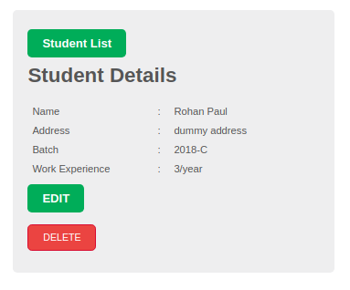

Bare bone REST API implementation with CRUD ops for a student management system (mongo running in mLab). No authentication.

A live version running [here at Heroku](https://fierce-sierra-18214.herokuapp.com/)

To run it locally, git clone and then

``npm install``

``sudo service mongod start``

``nodemon``